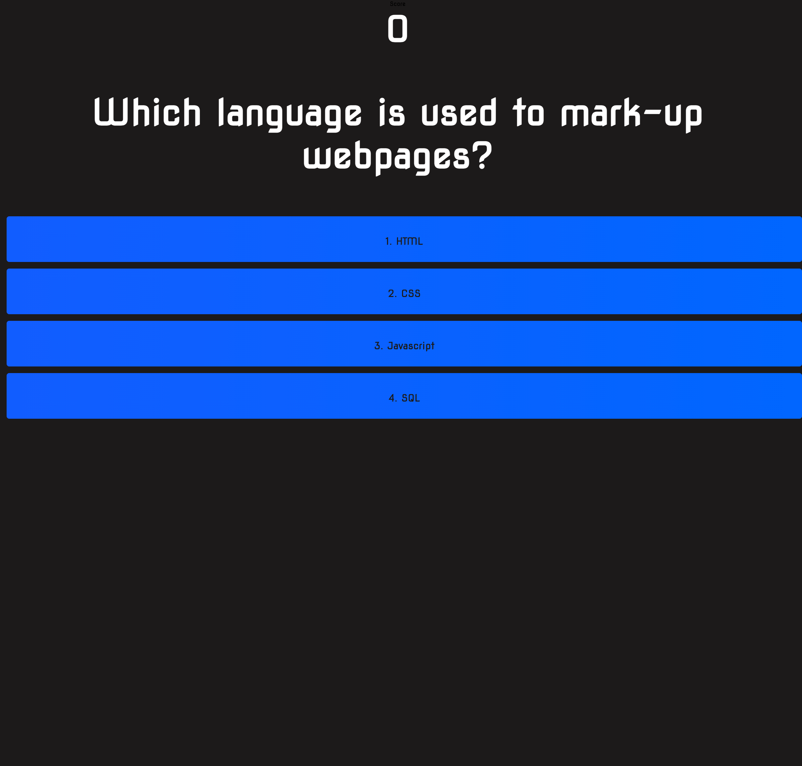

# Coding Quiz 👨🏻‍💻

## Description

This is a quiz app that will test your coding knowledge!

[🚀 Launch!](https://leon-luna-ray.github.io/coding-quiz/)

## Table of Contents

- [Image](#image)
- [Technologies](#technologies)
- [Known-Bugs](#known-bugs)
- [Next-Steps](#next-steps)
- [License](#license)
- [Contact](#contact)
- [Links](#links)

## Technologies

- React.js
- Javascript
- Vite.js
- HTML
- CSS
- Fontawesome
- Google Fonts
- Netlify

## Image

## Known-Bugs

Styling issues with CSS flexbox

## Next-Steps

- Complete high scores page
- Add more questions
- Randomize questions
- Question timer with variable score

## License

This project is licensed under the [MIT](https://opensource.org/licenses/MIT) license.

## Contact

Author: Ray Luna

If you have any questions about the repo, open an issue or contact me directly at:

- E-Mail: leon.luna.ray@gmail.com
- GitHub: [leon-luna-ray](https://github.com/leon-luna-ray)

## Links

- [Deployed Project](https://leon-luna-ray.github.io/coding-quiz/)

- [Project Repository](https://github.com/leon-luna-ray/coding-quiz)
