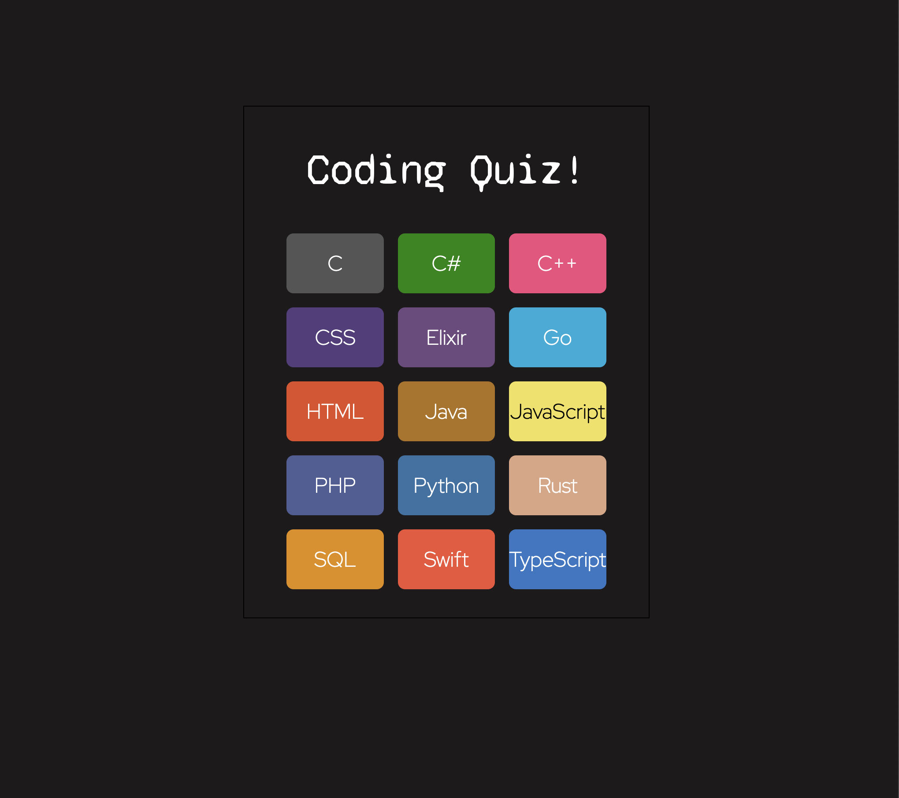
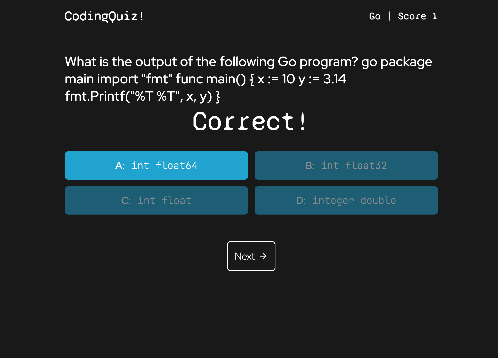

# Coding Quiz 👨🏻‍💻

[](https://app.netlify.com/sites/coding-quiz-rldev/deploys)

**🚀 [Live Demo](https://coding-quiz-rldev.netlify.app/)**

## Overview

An interactive coding quiz application that tests your programming knowledge across **15 different programming languages**! This project leverages **Google AI Studio (Gemini 2.5 Flash)** to dynamically generate unlimited, contextual quiz questions for each programming language.

A full-stack AI powered project showcasing modern web development practices, serverless architecture, and AI integration.

## Key Features

- **AI-Powered Question Generation**: Dynamic quiz questions generated using Google's Gemini 2.5 Flash model
- **Multi-Language Support**: 15 programming languages including JavaScript, Python, Java, C++, Rust, Elixir, and more
- **Real-time Scoring**: Instant feedback and score tracking throughout the quiz
- **Responsive Design**: Optimized for desktop and mobile devices using TailwindCSS
- **Serverless Architecture**: Cloudflare Workers backend for scalable, edge-deployed API
- **Modern Tech Stack**: React 19, Vite, React Router, and Context API

## How It Works

### Architecture Overview
```
┌─────────────────┐    HTTP Requests    ┌──────────────────┐    AI Generation    ┌─────────────────┐
│   React Client  │ ──────────────────► │ Cloudflare Worker│ ──────────────────► │  Google Gemini  │
│   (Frontend)    │                     │   (Serverless    │                     │   AI Studio     │
│                 │ ◄────────────────── │    Backend)      │ ◄────────────────── │                 │
└─────────────────┘    JSON Response    └──────────────────┘   Quiz Questions    └─────────────────┘
```

### Question Generation Process
1. **User Selection**: Choose from 15 available programming languages
2. **API Request**: Frontend sends request to Cloudflare Worker with language parameter  
3. **AI Generation**: Worker calls Google Gemini API with structured prompts
4. **Data Processing**: AI response is parsed and formatted into quiz format
5. **Interactive Quiz**: Questions delivered with multiple-choice answers and real-time scoring

### Supported Languages
- **Systems**: C, C++, Rust, Go
- **Web**: JavaScript, TypeScript, HTML, CSS, PHP  
- **General Purpose**: Python, Java, C#, Swift
- **Specialized**: SQL, Elixir

## Technical Implementation

- **Frontend**: React 19 with functional components and hooks
- **State Management**: React Context API for global game state
- **Routing**: React Router for single-page application navigation
- **Styling**: TailwindCSS 4 with custom component classes
- **Build Tool**: Vite for fast development and optimized builds
- **Backend**: Cloudflare Workers for serverless API deployment
- **AI Integration**: Google Gemini 2.5 Flash via REST API
- **Hosting**: Netlify (Frontend) + Cloudflare Workers (Backend)

## Table of Contents

- [Screenshot](#screenshot)
- [Getting Started](#getting-started)
- [Technologies](#technologies)
- [Project Structure](#project-structure)
- [Deployment](#deployment)
- [Future Enhancements](#future-enhancements)
- [License](#license)
- [Contact](#contact)

## 📸 Screenshot




## 🚀 Getting Started

### Prerequisites
- Node.js 18+ 
- npm or pnpm
- Google AI Studio API Key
- Cloudflare Workers account (for backend deployment)

### Local Development

1. **Clone the repository**
   ```bash
   git clone https://github.com/leon-luna-ray/coding-quiz.git
   cd coding-quiz
   ```

2. **Setup Frontend**
   ```bash
   cd client
   pnpm install
   cp .env.example .env
   # Add your worker URL to .env
   pnpm dev
   ```

3. **Setup Backend Worker**
   ```bash
   cd ../worker
   npm install
   # Configure your Google AI Studio API key in .dev.vars
   echo "GOOGLE_GEMINI_API_KEY=your_api_key_here" > .dev.vars
   echo "ALLOWED_ORIGINS=http://localhost:5173" >> .dev.vars
   npm run dev
   ```

4. **Access the application**
   - Frontend: `http://localhost:5173`
   - Worker: `http://localhost:8787`

## 🔧 Technologies

### Frontend
- **React 19** - Modern UI library with latest features
- **Vite** - Fast build tool and dev server  
- **React Router DOM** - Client-side routing
- **TailwindCSS 4** - Utility-first CSS framework
- **Axios** - HTTP client for API requests

### Backend  
- **Cloudflare Workers** - Serverless edge computing platform
- **Google Gemini 2.5 Flash** - AI model for question generation
- **Wrangler** - Cloudflare Workers development tool

### Development & Deployment
- **Netlify** - Frontend hosting and CI/CD
- **Cloudflare** - Global CDN and Workers platform
- **Git** - Version control
- **Environment Variables** - Secure configuration management

## 📁 Project Structure

```
coding-quiz/
├── client/                 # React frontend application
│   ├── src/
│   │   ├── components/     # Reusable UI components
│   │   ├── contexts/       # React Context providers  
│   │   ├── views/          # Page-level components
│   │   ├── lib/           # Utility functions and API calls
│   │   ├── assets/        # Static assets and styles
│   │   └── App.jsx        # Main application component
│   ├── package.json       # Frontend dependencies
│   └── vite.config.mjs    # Vite configuration
│
├── worker/                # Cloudflare Workers backend
│   ├── src/
│   │   └── worker.js      # Main worker logic and AI integration
│   ├── wrangler.toml      # Worker deployment configuration
│   └── package.json       # Worker dependencies
│
└── README.md              # Project documentation
```

## License

This project is licensed under the [MIT](https://opensource.org/licenses/MIT) license.
[](https://opensource.org/licenses/MIT)

## Contact

**Ray Luna** - Full-Stack Developer

If you have any questions about the project, want to collaborate, or just want to connect:

- **Email**: leon.luna.ray@gmail.com
- **GitHub**: [leon-luna-ray](https://github.com/leon-luna-ray)
- **Portfolio**: [https://www.rayluna.dev](https://www.rayluna.dev)

---

If you found this project helpful, please consider giving it a star on GitHub!

## Links

- [Deployed Project](https://leon-luna-ray.github.io/coding-quiz/)

- [Project Repository](https://github.com/leon-luna-ray/coding-quiz)
