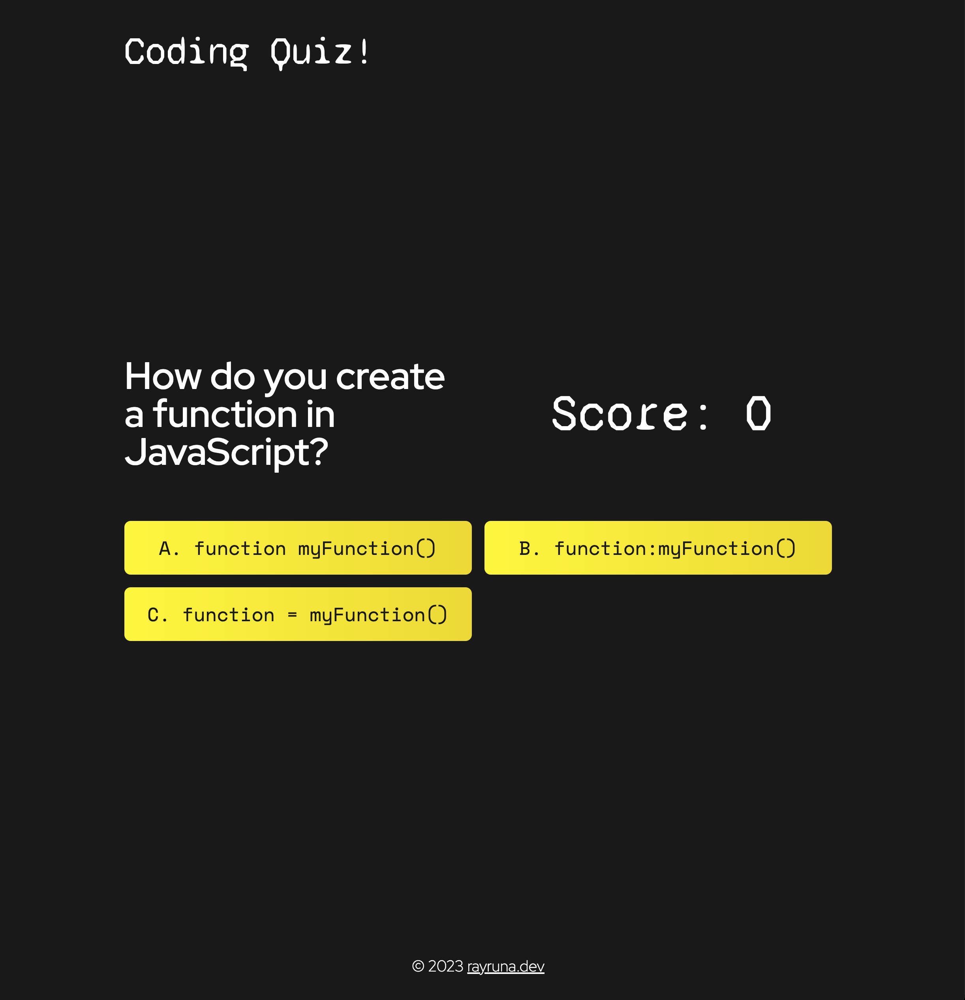

# Coding Quiz 👨🏻‍💻

## Description

This is a quiz app that will test your coding knowledge! The app is built with React.js. Questions are generated with Google AI Studio through serverless fucntions to the React frontend.

[🚀 https://coding-quiz-rldev.netlify.app/](https://coding-quiz-rldev.netlify.app/)

## Table of Contents

- [Image](#image)
- [Technologies](#technologies)
- [Known-Bugs](#known-bugs)
- [Next-Steps](#next-steps)
- [License](#license)
- [Contact](#contact)
- [Links](#links)

## Technologies
- JavaScript
- React.js
- CSS3
- HTML5
- TailwindCSS
- Vite.js
- Cloudflare Workers
- Google AI Studio

## Image

## License

This project is licensed under the [MIT](https://opensource.org/licenses/MIT) license.

## Contact

Author: Ray Luna

If you have any questions about the repo, open an issue or contact me directly at:

- E-Mail: leon.luna.ray@gmail.com
- GitHub: [leon-luna-ray](https://github.com/leon-luna-ray)

## Links

- [Deployed Project](https://leon-luna-ray.github.io/coding-quiz/)

- [Project Repository](https://github.com/leon-luna-ray/coding-quiz)
